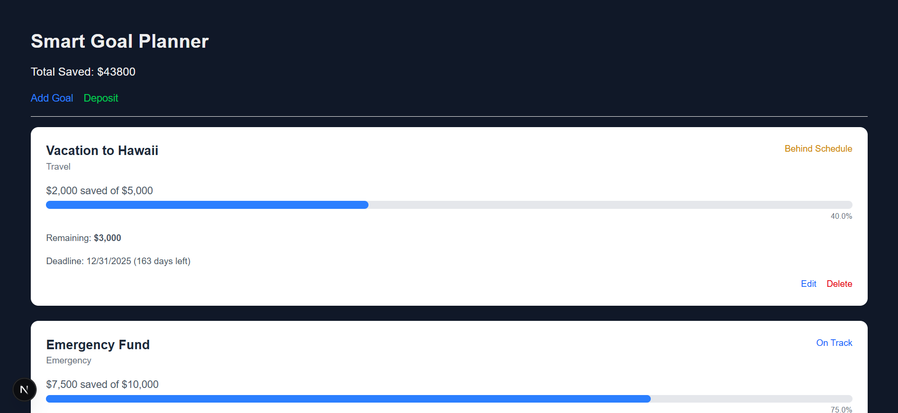

## Smart Goal Planner
Welcome to Smart Goal Planner, your personal assistant for setting, tracking, and smashing your financial goals. Whether you want to save for a dream trip, an emergency fund, or that shiny new gadget, this app keeps you focused and motivated with a clean, simple, and intuitive interface.

## Preview

## Why I Built This
Life gets busy, and goals sometimes slip through the cracks. I wanted a tool that’s not just functional but actually enjoyable to use, something to help me plan my savings in a smart, stress-free way.

So, I built Smart Goal Planner to make goal-setting clear, manageable, and visually motivating, because tracking progress should feel rewarding, not overwhelming.

## Features
 - Goal Management:
Add, edit, and delete financial goals with ease. Set target amounts, deadlines, and categories to keep things organized.

 - Deposit Tracking:
Keep tabs on how much you've saved toward each goal and make deposits right in the app.

- Visual Overview:
Get an at-a-glance summary of your total savings and progress on individual goals.

- Clean & Responsive UI:
Whether you’re on your phone or desktop, the app adapts smoothly for a great experience everywhere.

## Tech Stack
| Tech             | Purpose                                  |
|------------------|------------------------------------------|
| Next.js	         | |React framework for the frontend        |
|React Hooks       | Manage state and side effects            |
| Tailwind CSS     | Fast and modern styling                  |
| Custom API Lib   | Manage goals data (mock or real)         |

---
	
 ## How to Run Locally
Prerequisites
- [Node.js]  installed on your machine

A terminal or command prompt

#### Setup Steps
bash
Copy
Edit

### Clone the repo
git clone https://github.com/yourusername/smart-goal-planner.git
cd smart-goal-planner

### Install dependencies
npm install

### Run the development server
npm run dev
Open http://localhost:3000 in your browser to start planning your goals!

## What I Learned
- Building dynamic forms with React hooks

- Handling client-side routing and layouts in Next.js

- Creating reusable components with Tailwind CSS styling

- Managing local state and asynchronous API calls

 ## Future Plans
 - Add user authentication and personalized goal tracking

 - Connect to a real backend or database

 - Add charts and better visualizations for goal progress

 - Turn it into a Progressive Web App (PWA) for offline use

 - Smart reminders and notifications to keep you on track

 ## About Me
Hey, I’m the creator behind Smart Goal Planner, passionate about crafting simple tools that make everyday life easier and more fulfilling. When I’m not coding, you’ll find me dreaming up new ways to blend productivity with creativity.

Feel free to connect or suggest features, I love hearing from fellow goal-getters and coders alike!

---

 ## Get In Touch
GitHub:Mercy-5k

Email: kiqsmercy@gmail.com

## License

This project is licensed under the [MIT License](LICENSE).

Feel free to use, modify, and distribute this project for personal or commercial purposes — just give credit where it’s due.

